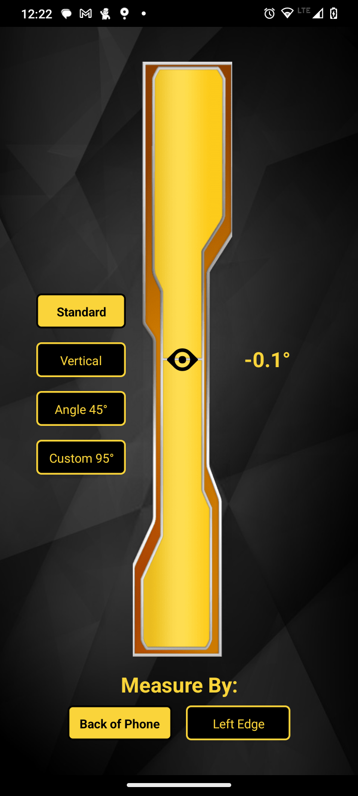

## angleSense

"angleSense" is a versatile mobile application designed for accurate angle measurement and orientation tracking. Whether you need to measure angles for DIY projects, construction, or just for fun, this app provides an easy-to-use solution. Say goodbye to complicated tools and enjoy the convenience of angle measurement on your smartphone.

## Screenshots
    

## Features

- **Precise Angle Measurement**: Measure angles with high precision, ranging from 0 to 180 degrees.
- **User-Friendly Interface**: The app offers an intuitive and user-friendly interface, making it easy to use for everyone.
- **Customizable Angle Setting**: Set your custom angles for measurement.
- **Two Measurement Modes**: Choose between two measurement modes: "Back of Phone" and "Left Edge," offering flexibility in your measurements.
- **Real-Time Orientation Tracking**: Get real-time data about the orientation of your device.
- **Modal Input for Custom Angles**: Easily input and confirm custom angles for specialized measurements.

## Instalation
You can download and install an .apk file from [here](https://drive.google.com/file/d/1xIY8CObXz7csw9MuRjO54r61fv_4I-cR/view?usp=sharing)

## Usage

1. Launch the "angleSense" app on your Android device.

2. Select your preferred measurement mode: "Back of Phone" or "Left Edge."

3. Choose from standard angle measurements (0°, 90°, 45°) or input a custom angle.

4. Follow the on-screen instructions to calibrate and start measuring angles.

5. Enjoy precise and convenient angle measurements.

